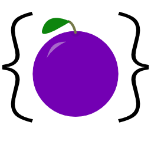

<h1>Plums</h1>

API: [wrello.github.io/Plums/](https://wrello.github.io/Plums/)

⚠️Currently in beta. Not recommended for use in production.⚠️

- Supports nested plums
- Includes server side plum events
- Propogates value changed events from sub-tables
- Supports `Event:Observe()` to collect prior values
- Uses [Squash](https://github.com/Data-Oriented-House/Squash/) to compress overhead data

<h2>Quick Start</h2>

Initialize client-side & server-side first:
```lua
-- Server
local Plums = require(game.ReplicatedStorage.Plums.PlumsServer)
Plums:Init()
```
```lua
-- Client
local Plums = require(game.ReplicatedStorage.Plums.PlumsClient)
Plums:Init()
```

Then create a plum on the server:
```lua
local playerPlum = Plums.new("Player", {
  Coins = 0
}):AddAllClients():EnableAutoAddClient()

playerPlum:SetValue({"Coins"}, 5)
```

And listen to changes the client:
```lua
Plums.PlumReceived("Player"):Observe(function(playerPlum)
  print("Player plum received:", playerPlum.Data)

  playerPlum.ValueChanged({"Coins"}):Observe(function(newVal, oldVal)
    print("Coins:", newVal)
  end)
end)
```


Inspired by loleris's [ReplicaService](https://github.com/MadStudioRoblox/ReplicaService).
